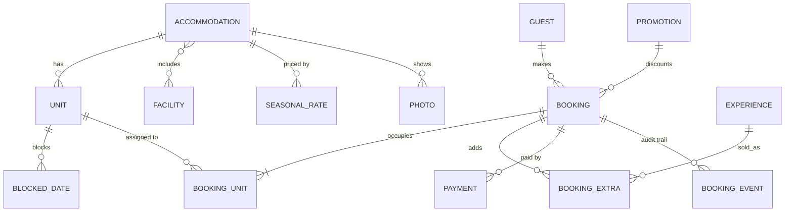
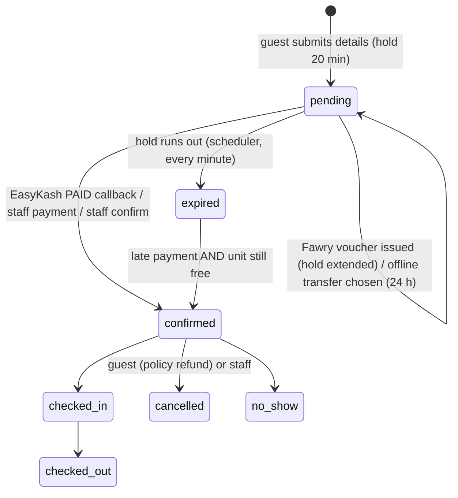

# Architecture

Laravel 12 · Livewire 3 · Filament 3 · Tailwind v4 · Alpine (bundled with Livewire) · GSAP · Spatie Translatable · MySQL 8.

```
app/
  Enums/                 BookingStatus, PaymentStatus, BookingPaymentStatus, PaymentProvider, UserRole, AdjustmentType
  Models/                Accommodation, Unit, Facility, Experience, Photo, SeasonalRate, BlockedDate, Promotion,
                         Guest, Booking, BookingUnit, BookingExtra, BookingEvent, Payment,
                         ContentBlock, Page, Faq, Setting, ContactMessage, User
  Support/               StayRequest (input DTO), Quote (itemised price DTO)
  Services/
    AvailabilityService  free units, camp/accommodation calendars, admin grid
    PricingService       nightly rates, seasons, extra guests, add-ons, promos, taxes, deposit
    BookingService       holds (row-locked), confirm, payments, cancel/refund policy, check-in/out, reassign, expire
    Payments/            PaymentGateway, EasyKashGateway, PaymentManager
  Livewire/BookingWizard 3-step booking UI → hold → checkout
  Http/Controllers/      public pages, checkout, payment return/callback, manage booking, availability API
  Filament/              admin resources, calendar page, settings page, dashboard widgets
lang/{en,ar,he}/         site.php, booking.php, mail.php
resources/views/         layouts, components (logo, icon, cards, search bar), pages, livewire, mail, pdf
```

## Data model



*Accommodation* is the sellable type ("Sea-View Vaulted Chalet"); *Unit* is the physical room ("C-04"). Guests book a type; the system assigns a unit (staff can move it later).

## Availability rules

- A **night** is the date you sleep. Stay 10→12 Oct = nights 10 and 11. Overlap test: `a.check_in < b.check_out AND a.check_out > b.check_in` → same-day turnover allowed.
- Inventory is held by booking units whose booking is `confirmed`, `checked_in`, or `pending` with a live `expires_at`.
- Blocks: unit-only, whole accommodation type, or whole camp (both ids null).

## Double-booking protection

`BookingService::createHold()` runs in a DB transaction and `SELECT … FOR UPDATE` locks every unit row of the accommodation before checking overlaps and inserting. Two concurrent guests serialize on those locks; the second sees the unit taken and gets the next one or a "just booked" error. (Requires InnoDB / MySQL 8 or PostgreSQL; SQLite ignores row locks.)

## Booking lifecycle



## Pricing order (PricingService)

1. Base price, or weekend price on weekend nights (Thu & Fri by default, configurable).
2. Highest-priority active seasonal rate covering the night (accommodation-specific beats camp-wide on ties), honoring weekday filter and min-nights → fixed / ±% / ±amount.
3. Extra occupants above base occupancy × nights (adults fill base first).
4. Pet fee × nights (setting).
5. Add-on experiences (per person or per group).
6. Promotion (code, else best automatic) on accommodation + add-ons.
7. Service charge, then VAT on the discounted amount.
8. Due now = total × deposit % (100 = full).

## Payments — EasyKash

| Step | Where |
|---|---|
| Create payment row, POST `/api/directpayv1/pay` with `customerReference`, get `redirectUrl` | `PaymentManager::startOnline`, `EasyKashGateway::initiate` |
| Guest returns to `/{locale}/payments/easykash/return/{ref}` — page polls status, never trusts query params | `PaymentController::easykashReturn`, `pages/booking/return` |
| Server callback `POST /payments/easykash/callback` (CSRF-exempt) — HMAC-SHA512 over `ProductCode·Amount·ProductType·PaymentMethod·status·easykashRef·customerReference` | `PaymentManager::handleEasyKashCallback` |
| Amount must match, idempotent, PAID → confirm, PENDING (Fawry) → extend hold, FAILED/EXPIRED → mark | same |

Configure the callback URL `https://<domain>/payments/easykash/callback` in the EasyKash merchant dashboard. Field names and payment-option ids are isolated in `EasyKashGateway` — confirm them against your merchant documentation at go-live.

Offline methods (bank transfer / InstaPay / cash) are recorded by staff from the booking page, which runs the same confirmation logic.

## Multilingual

- URL prefix `/{en|ar|he}`; root redirects by session → browser language. `hreflang` alternates, `og:locale`, sitemap per locale.
- `SetLocale` middleware also registered as Livewire persistent middleware so wizard updates keep the language.
- Content: Spatie translatable JSON columns, edited in Filament with a locale switcher. UI strings: `lang/*`.
- RTL for Arabic and Hebrew via `dir` + logical utilities; each script has its own serif/sans pairing.
- Validation messages: `php artisan lang:add ar he` (laravel-lang/common, dev dependency) then commit `lang/`.
- Guest emails are sent in the booking's language. PDF receipts are English (DomPDF lacks Arabic shaping; swap to mPDF if needed).

## Admin roles

| Role | Access |
|---|---|
| admin | everything, staff accounts |
| manager | stays, units, experiences, facilities, pricing, promotions, content, settings, bookings |
| reception | calendar, bookings, guests, payments, enquiries, blocked dates |

## Security notes

- Guest access to a booking = reference + email lookup, or the 48-char `manage_token` link from emails (constant-time compare).
- Rate limits on contact, hold creation, lookup, payment start, callback.
- Honeypot on contact form; CSRF on all forms except the signed gateway callback.
- No card data touches the server.
